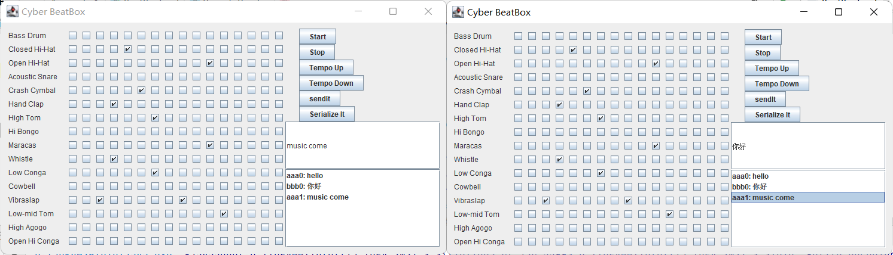

# MusicDatingRoom

# 一、简介

音乐交友室，可以发送选中节拍，发送消息

# 二、部署

把final.java和server.java放于同一文件下运行即可

final.java实际就是客户端，先运行server.java，再运行客户端

# 三、运行截图

# 四、总结

## （一）Runnable

### 1.服务端

ClientHandler，实现了Runnable接口。

in对象是一个ObjectInputStream，它用于从Socket中读取客户端发送的数据。而sock对象则是客户端的Socket连接。

用于接收客户端发送的对象，并通过tellEveryone()将其广播给所有连接到该服务器的客户端。

### 2.客户端

RemoteReader，实现了Runnable接口。它的作用是从服务器端读取数据，并更新客户端的UI界面。

在run()方法中，使用while循环不断从ObjectInputStream中读取对象，并将其转换为字符串和布尔数组。然后，使用其他成员变量将这些数据存储到客户端的数据结构中，包括将数据存储到一个Map和一个Vector中，并更新客户端的UI界面。

总体来说，这段代码是一个用于从服务器端读取数据并更新客户端UI界面的程序。

它通过不断从ObjectInputStream中读取对象，并将其转换为字符串和布尔数组，然后将这些数据存储到客户端的数据结构中，并更新UI界面。

## （二）主线程

### 1.服务端

处理客户端连接的请求

### 2.客户端

连接服务端、设置midi，显示界面
